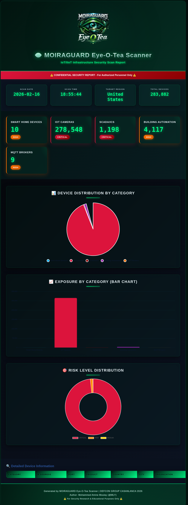

# MOIRAGUARD - Eye O Tea (IoT) Scanner

<div align="center">

[](https://github.com/Moiraguard/moiraguard-eye-o-tea-scanner)
[](https://www.python.org/)
[](https://github.com/Moiraguard/moiraguard-eye-o-tea-scanner)
[](https://www.linkedin.com/company/defcon-group-casablanca)

</div>

<div align="center">
  

  ### 👁️ Global IoT/IIoT Infrastructure Reconnaissance
  **Monitoring IoT Reconnaissance & Guard**
</div>

## 📖 Overview

**MOIRAGUARD** (Eye-O-Tea) is an advanced IoT/IIoT security reconnaissance framework designed for security research and educational purposes. Built for DEFCON GROUP CASABLANCA 2026, this tool performs passive reconnaissance on global IoT infrastructure using the Shodan API.

---

### 🏷️ Current Version — v1.3

> **What's new in v1.3 — Active Protocol Verification**
>
> Previous versions discovered exposed devices by querying Shodan's indexed database.
> v1.3 goes one step further: after discovery, MOIRAGUARD connects **directly** to each
> device and confirms whether it truly accepts connections without credentials.
>
> The output changes from:
> ```
> [◆] Found 12,847 exposed RTSP cameras
> ```
> to:
> ```
> [◆] Found 12,847 RTSP cameras  →  [CONFIRMED] 3,291 stream without credentials
> ```
>
> This is the difference between a **Shodan count** and a **real security finding**.
> No extra Shodan credits are consumed — probing uses direct TCP/UDP sockets only.

| Version | Highlights |
|---------|-----------|
| **v1.3** ✅ | **Active Protocol Verification** — MQTT, RTSP, Modbus, BACnet, HTTP/HTTPS probing |
| v1.2 ✅ | Mode selection menu — Scanner, Monitor, Intelligence modes |
| v1.1 ✅ | Export engine — JSON, CSV, HTML reports, PNG charts |
| v1.0 ✅ | Core IoT/IIoT reconnaissance across 6 device categories |

> [!CAUTION]
> **Legal Warning — Read before using the Verify Exposure feature.**
>
> Unlike the Query Mode (which only reads Shodan's existing index), the Verification step
> makes **real outbound TCP/UDP connections from your machine to the target IPs**.
>
> - **Your IP address is visible to every device you probe.** Firewalls, IDS/IPS systems,
>   and honeypots on the target side will log your connection attempt, your source IP,
>   and the exact packet you sent.
> - **Probing a system without explicit written permission from its owner is illegal**
>   in most jurisdictions — including Morocco (Law 09-08), the EU (GDPR + Computer Misuse
>   laws), and the United States (CFAA). The fact that a device appeared in a Shodan search
>   does **not** constitute permission to connect to it.
> - **Your IP may be flagged, blocklisted, or reported** to your ISP or law enforcement
>   if a target's security monitoring detects the probe.
> - Running this feature from a **corporate or university network** may violate your
>   organisation's acceptable-use policy, regardless of the target.
>
> **Only use Verify Exposure against systems you own or have explicit written authorisation
> to test.** Authorised use cases include: your own lab/homelab, a pentest engagement with
> a signed scope-of-work, or a CTF environment.

---

### Author
**Mohammed Amine Moulay (@MLY)**
DEFCON GROUP CASABLANCA 2026 | Security Research

### 🔗 Quick Links
- **Repository**: https://github.com/Moiraguard/moiraguard-eye-o-tea-scanner
- **Issues & Bug Reports**: https://github.com/Moiraguard/moiraguard-eye-o-tea-scanner/issues
- **Pull Requests**: https://github.com/Moiraguard/moiraguard-eye-o-tea-scanner/pulls
- **Releases**: https://github.com/Moiraguard/moiraguard-eye-o-tea-scanner/releases

## 📸 Example Output

<div align="center">
  
  <br><br>
  <em>🎯 Example Report: United States IoT Infrastructure Scan - 283,882 Devices Discovered</em>
  <br>
  <sub>HTML Report with Cyberpunk Neon Theme | Interactive Charts | Risk Analysis | Country-Targeted Reconnaissance</sub>
</div>

**Report Highlights:**
- 👁️ **Cyberpunk Neon Emerald Design** - Dark theme with glowing accents and glassmorphic UI
- 📊 **Interactive Visualizations** - Pie charts, bar graphs, and risk level doughnuts
- 🎯 **Multi-Category Analysis** - Smart Home (10) | Cameras (278K) | SCADA (1.2K) | Building (4K) | MQTT (9)
- 🚨 **Risk Classification** - Real-time CRITICAL/HIGH/MEDIUM indicators
- 🌍 **Country-Specific Targeting** - 50+ countries supported
- 💾 **Multiple Export Formats** - JSON, CSV, HTML, PNG screenshots

## ⚠️ LEGAL DISCLAIMER

```
╔═══════════════════════════════════════════════════════════════╗
║                      ⚠️  LEGAL WARNING ⚠️                     ║
╠═══════════════════════════════════════════════════════════════╣
║                                                               ║
║  This tool is for SECURITY RESEARCH and EDUCATION ONLY        ║
║                                                               ║
║  • Unauthorized access to computer systems is ILLEGAL         ║
║  • This tool performs PASSIVE reconnaissance only             ║
║  • Do NOT attempt to access systems without authorization     ║
║  • Use RESPONSIBLY and ETHICALLY                              ║
║  • The author is NOT responsible for misuse                   ║
║                                                               ║
║  By using this tool, you agree to comply with all applicable  ║
║  laws and regulations. The user assumes all responsibility.   ║
║                                                               ║
╚═══════════════════════════════════════════════════════════════╝
```

**Legal Use Cases:**
- Security research and vulnerability assessment
- Educational purposes and IoT security training
- Defensive security operations
- Authorized penetration testing
- Academic research

**Illegal Use Cases:**
- Unauthorized access to systems
- Exploitation of discovered vulnerabilities
- Any malicious activity

## 🎯 Features

### Current Features (v1.3)

- **Active Protocol Verification** — confirms real unauthenticated access, not just Shodan estimates
  - Runs directly after a Verbose scan from the post-scan menu (`[V]`)
  - Probes each discovered IP with the correct protocol packet — **zero Shodan credits consumed**
  - Parallel probing via thread pool (10 workers) — fast even for large IP lists
  - Per-IP `[CONFIRMED]` / `[protected]` output in real time
  - Final exposure rate: *"X% of sampled devices have NO authentication"*
  - See [Active Protocol Verification](#-active-protocol-verification) for full details

- **Four Operation Modes** — selected at startup before any scan
  - **[1] Query Mode** — Search Shodan's indexed database (original behavior)
  - **[2] Scanner Mode** — Submit on-demand active scans of IP/CIDR targets via `api.scan()`; polls status in real-time with a spinner; optionally queries results when done
  - **[3] Monitor Mode** — Manage persistent Shodan network alerts: list, create, inspect, and delete alerts via `api.create_alert()` / `api.alerts()`
  - **[4] Intelligence Mode** — View all Shodan-known protocols and scanned ports grouped by range; IoT-relevant ports (554, 1883, 502, 47808, 23, 80, 443) are highlighted; **zero credits consumed**

- **Multi-Category IoT Scanning**
  - Smart Home Appliances & Consumer IoT
  - IoT Cameras & Surveillance Systems (RTSP)
  - SCADA/Industrial Control Systems (Modbus)
  - Building Automation Systems (BACnet)
  - IoT MQTT Messaging Brokers
  - Industrial IoT Gateways & Automation

- **Country-Specific Targeting**
  - Select from 50+ predefined countries
  - Custom country code input option
  - Global scan mode (no country filter)
  - Configurable via `countries.json`

- **Dual Verbosity Modes**
  - **Metrics Mode**: Fast scans collecting only counts and totals
  - **Verbose Mode**: Detailed scans including IP addresses, organizations, and device details

- **Advanced Export & Reporting**
  - **JSON Export**: Structured data for API integration
  - **CSV Export**: Spreadsheet-friendly format
  - **HTML Reports with Interactive Charts**:
    - Beautiful pie charts showing device distribution
    - Bar charts for category comparison
    - Risk level doughnut charts
    - Responsive design with Chart.js
    - Optional detailed device tables in verbose mode
  - **PNG Charts Export** (NEW!):
    - High-resolution pie chart (300 DPI)
    - Bar chart with value labels
    - Risk level doughnut chart
    - Combined summary chart
    - Perfect for presentations and reports
  - Export all formats at once
  - Organized in `Moiraguard-Eye-O-Tea-Exports/` directory

- **Advanced Reconnaissance**
  - Geographic distribution analysis
  - Vendor identification
  - Risk level assessment
  - Sample device enumeration
  - Real-time statistics

- **Rich CLI Interface**
  - Colorized output
  - Typewriter effects
  - Loading animations
  - Progress indicators
  - Beautiful ASCII art banner

- **Security Features**
  - API key stored in separate file
  - `.gitignore` protection for credentials
  - Passive reconnaissance only
  - Legal warnings and reminders

## 📁 Project Structure

```
moiraguard-eye-o-tea-scanner/
├── moiraguard_iot_scanner.py    # Main scanner application
├── check_setup.py                # Setup verification tool
├── requirements.txt              # Python dependencies
├── countries.json                # Country code mappings (50+ countries)
├── targets.json                  # Scan profile configurations
├── shodan_api.key               # Your Shodan API key (create this)
├── examples/                     # Example files (tracked in git)
│   ├── MoiraGuard-Eye-O-Tea-logo.png
│   ├── moiraguard_report_20260216_185544.png
│   └── README.md
├── Moiraguard-Eye-O-Tea-Exports/ # Scan outputs (git ignored)
│   ├── *.json                   # JSON exports
│   ├── *.csv                    # CSV exports
│   ├── *.html                   # HTML reports
│   └── *.png                    # Chart/screenshot exports
└── README.md                     # This file
```

**Note:**
- The `examples/` folder contains sample files for documentation (included in git)
- The `Moiraguard-Eye-O-Tea-Exports/` folder is created automatically and excluded from git (sensitive data)
- Your API key file (`shodan_api.key`) is protected by `.gitignore`

## 🚀 Installation

### Prerequisites

- **Python 3.7 or higher**
- **Shodan API account** (Membership recommended)
- **Internet connection**

### Step-by-Step Setup

#### 1. Clone the Repository
```bash
git clone https://github.com/Moiraguard/moiraguard-eye-o-tea-scanner.git
cd moiraguard-eye-o-tea-scanner
```

#### 2. Install Python Dependencies
```bash
# Using pip
pip install -r requirements.txt

# Or using pip3
pip3 install -r requirements.txt

# Or install manually
pip install shodan matplotlib
```

#### 3. Get Your Shodan API Key

1. Go to: https://account.shodan.io/
2. Register for an account or login
3. Navigate to "My Account" section
4. Copy your API key

**Shodan Membership Required:**

This tool requires a **Shodan Membership** ($59/month or $899/lifetime) for optimal functionality:
- **Query Credits**: 10,000+ per month (vs 100 on free)
- **Results**: Full result sets (vs 1 page on free)
- **Filters**: Advanced country and protocol filters
- **Historical Data**: Access to historical scan data
- **API Features**: Full API capabilities needed for this tool

**Note:** Free accounts are very limited and may not provide enough data for meaningful scans. Consider the membership as an investment in your security research capabilities.

#### 4. Configure Your API Key

**Option A: Create the key file manually**
```bash
# Linux/Mac
echo "YOUR_API_KEY_HERE" > shodan_api.key

# Windows (Command Prompt)
echo YOUR_API_KEY_HERE > shodan_api.key

# Windows (PowerShell)
"YOUR_API_KEY_HERE" | Out-File -FilePath shodan_api.key -NoNewline
```

**Option B: Use a text editor**
1. Create a new file named `shodan_api.key` in the tools directory
2. Paste your API key (single line, no spaces or quotes)
3. Save the file

**Example file content:**
```
Ab1Cd2Ef3Gh4Ij5Kl6Mn7Op8Qr9St0Uv
```

#### 5. Verify Installation

**Quick Verification (Automated):**
```bash
# Run the setup checker (recommended)
python3 check_setup.py
```

This will verify:
- ✓ Python version compatibility
- ✓ Shodan module installation
- ✓ API key file exists and valid
- ✓ Configuration files present
- ✓ Main scanner script ready
- ✓ API connection working

**Manual Verification:**
```bash
# Check Python version
python3 --version  # Should be 3.7 or higher

# Check Shodan installation
python3 -c "import shodan; print('Shodan installed successfully')"

# Verify API key file exists
ls -l shodan_api.key  # Linux/Mac
dir shodan_api.key    # Windows
```

#### 6. Customize Configuration (Optional)

**Edit `countries.json`** to add/remove countries:
```json
{
  "countries": {
    "Your Country": "YC",
    "Morocco": "MA",
    "United States": "US"
  }
}
```

**Edit `targets.json`** for custom scan profiles:
- Pre-configured regional profiles
- Custom query templates
- Sector-specific scans

## 📝 Usage

### Quick Start

```bash
# Navigate to tools directory
cd DEFCON-GROUP-CASA/tools

# Run the scanner
python3 moiraguard_iot_scanner.py
```

### Complete Usage Walkthrough

#### Step 1: Launch the Scanner

```bash
python3 moiraguard_iot_scanner.py
```

You'll see the MOIRAGUARD banner and initialization:

```
╔═══════════════════════════════════════════════════════════════════════╗
║                     MOIRAGUARD Eye-O-Tea                              ║
╚═══════════════════════════════════════════════════════════════════════╝

[✓] API key loaded from shodan_api.key
[i] Key length: 32 characters
```

#### Step 2: Select Operation Mode

After loading your API key, MOIRAGUARD presents the mode menu:

```
╔═══════════════════════════════════════════╗
║       SELECT OPERATION MODE             ║
╚═══════════════════════════════════════════╝

  [1] Query Mode      — Search Shodan's indexed database (current behavior)
  [2] Scanner Mode    — On-demand active scan of IP/CIDR targets
  [3] Monitor Mode    — Set up persistent network alerts
  [4] Intelligence    — View Shodan protocols & active ports (free)

──────────────────────────────────────────────────

Select mode [1-4]:
```

**Mode descriptions:**

| Mode | Credits Used | Description |
|------|-------------|-------------|
| [1] Query Mode | ~6 query credits | Full IoT/IIoT reconnaissance scan across 6 device categories |
| [2] Scanner Mode | Scan credits | Submit active scans to Shodan's distributed scanner for specific IPs/CIDRs |
| [3] Monitor Mode | 0 | Manage persistent alerts that notify you of new Shodan findings |
| [4] Intelligence | 0 | Browse all protocols and scanned ports with IoT port cross-reference |

---

##### Scanner Mode walkthrough

1. Your scan-credit balance is displayed upfront with a warning if zero
2. Enter comma-separated IPs or CIDR ranges (e.g. `192.168.1.1, 10.0.0.0/24`)
3. Browse available scan protocols (paginated, press Enter/q to navigate)
4. Confirm submission — scan ID, queued IP count, and remaining credits are shown
5. A live spinner polls `api.scan_status()` every 5 seconds until `DONE`
6. Optionally query Shodan for the scanned IPs immediately after completion

##### Monitor Mode walkthrough

Sub-menu loop with four actions:

```
  [1] List active alerts
  [2] Create new alert (name + IP/CIDR)
  [3] Check alert results
  [4] Delete alert
  [0] Back
```

- **List**: shows alert ID, name, IP range, and creation date for all active alerts
- **Create**: prompts for a name and CIDR → calls `api.create_alert()`
- **Check**: enter an alert ID to view matched hosts (up to 10 shown)
- **Delete**: enter an alert ID, confirm, then permanently removes it

##### Intelligence Mode walkthrough

No credits consumed — marked `[FREE]` in the header.

1. **Protocols table** — all Shodan-known scan protocols, sorted alphabetically in a two-column layout
2. **Ports list** — all ports Shodan actively scans, grouped into three ranges:
   - Well-Known (0–1023)
   - Registered (1024–49151)
   - Dynamic (49152+)
3. **IoT cross-reference** — the following ports are starred (`*`) in the list and summarized in a dedicated table showing whether each is currently active in Shodan's scanner:

| Port | Protocol | Purpose |
|------|----------|---------|
| 23 | Telnet | Legacy devices / default credentials |
| 80 | HTTP | Web management interfaces |
| 443 | HTTPS | Secure web interfaces |
| 502 | Modbus | Industrial SCADA/ICS |
| 554 | RTSP | IP camera streams |
| 1883 | MQTT | IoT message brokers |
| 47808 | BACnet | Building automation |

---

#### Step 3: Select Target Country (Query Mode only)

When **Query Mode [1]** is selected, you'll see:

```
╔═══════════════════════════════════════════════════════════╗
║            SELECT TARGET COUNTRY              ║
╚═══════════════════════════════════════════════════════════╝

[0] GLOBAL (All countries - no filter)

[1] Morocco                  (MA)
[2] United States            (US)
[3] China                    (CN)
...

[C] Custom country code

Select option:
```

**Options:**
- Enter `0` for global scan (all countries)
- Enter a number (1-N) to select a specific country
- Enter `C` to input a custom 2-letter country code

#### Step 4: Choose Verbosity Level

Select how much detail you want to collect:

```
Scan Verbosity:
  [1] Metrics Only (Fast - counts and totals only)
  [2] Verbose Mode (Detailed - includes IPs and device info)

Select mode [1/2]:
```

**When to use Metrics Mode (1):**
- Quick overview scans
- Conserving API credits
- Only need statistics
- Faster processing

**When to use Verbose Mode (2):**
- Detailed security assessments
- Need specific IP addresses
- Creating comprehensive reports
- Investigating specific devices

#### Step 5: Scan Execution

The scanner will now:
1. Connect to Shodan API
2. Verify your credentials
3. Run 6 category scans sequentially
4. Display results in real-time

```
[✓] Shodan API connection established
[✓] API verified - Query credits: 100

[SCAN 1/6] ► SMART HOME APPLIANCES & CONSUMER IoT
Risk Level: HIGH ⚠️⚠️
[◆] Discovered 45,231 exposed smart home devices globally

[SCAN 2/6] ► IoT CAMERAS & SURVEILLANCE SYSTEMS (RTSP)
Risk Level: CRITICAL ⚠️⚠️⚠️
[!!!] Found 12,847 exposed camera streams
...
```

**Scan Duration:** Approximately 1-2 minutes per category (6-12 minutes total)

#### Step 6: Review Summary

After all scans complete, you'll see:
- Total devices discovered
- Category breakdown with percentages
- Risk level analysis
- Geographic distribution (if applicable)

#### Step 7: Export Results (Post-Scan Menu)

Choose how to export your findings:

```
╔═══════════════════════════════════════════════════════════╗
║            POST-SCAN OPTIONS                    ║
╚═══════════════════════════════════════════════════════════╝

[V] Verify Exposure — Active protocol probing (confirms unauthenticated access, 0 credits)
────────────────────────────────────────────────────────────
[1]  Export to JSON (Metrics Only)
[2]  Export to JSON (Verbose - with IP addresses)
[3]  Export to CSV (Metrics Only)
[4]  Export to CSV (Verbose - with device details)
[5]  Export to HTML with Charts (Metrics Only)
[6]  Export to HTML with Charts (Verbose - with device table)
[7]  Export Charts as PNG (4 chart images)
[8]  Export HTML as Long PNG (Metrics)
[9]  Export HTML as Long PNG (Verbose)
[10] Export ALL formats (Metrics Only)
[11] Export ALL formats + Screenshots (Verbose)
[0]  Exit

Select option:
```

> **Tip:** Run `[V]` before exporting — verified results give your report concrete confirmed findings rather than raw discovery counts.

**Export Recommendations:**

| Use Case | Recommended Option |
|----------|-------------------|
| PowerPoint presentation | Option 7 (PNG charts) |
| Quick web report | Option 5 (HTML - Metrics) |
| Detailed security report | Option 6 (HTML - Verbose) |
| Data analysis in Excel | Option 4 (CSV - Verbose) |
| API integration | Option 2 (JSON - Verbose) |
| Complete documentation | Option 9 (All formats + PNG) |

**After exporting:**
```
[✓] JSON exported to: Moiraguard-Eye-O-Tea-Exports/moiraguard_scan_20260216_163045.json
[✓] CSV exported to: Moiraguard-Eye-O-Tea-Exports/moiraguard_scan_20260216_163045.csv
[✓] HTML report exported to: Moiraguard-Eye-O-Tea-Exports/moiraguard_scan_20260216_163045.html
[✓] Pie chart exported: moiraguard_pie_chart_20260216_163045.png
[✓] Bar chart exported: moiraguard_bar_chart_20260216_163045.png
[✓] Risk chart exported: moiraguard_risk_chart_20260216_163045.png
[✓] Summary chart exported: moiraguard_summary_20260216_163045.png
[✓] All formats exported successfully!
```

#### Step 8: View Reports

**Open HTML Report:**
```bash
# Linux
xdg-open Moiraguard-Eye-O-Tea-Exports/moiraguard_scan_*.html

# Mac
open Moiraguard-Eye-O-Tea-Exports/moiraguard_scan_*.html

# Windows
start Moiraguard-Eye-O-Tea-Exports\moiraguard_scan_*.html

# Or just double-click the file
```

**View PNG Charts:**
```bash
# Linux
xdg-open Moiraguard-Eye-O-Tea-Exports/moiraguard_summary_*.png

# Mac
open Moiraguard-Eye-O-Tea-Exports/moiraguard_summary_*.png

# Windows
start Moiraguard-Eye-O-Tea-Exports\moiraguard_summary_*.png

# Or view all charts at once
ls Moiraguard-Eye-O-Tea-Exports/*.png
```

**View JSON:**
```bash
cat Moiraguard-Eye-O-Tea-Exports/moiraguard_scan_*.json | jq .
```

**Open CSV in Excel:**
- Double-click the .csv file
- Or open in Excel/LibreOffice Calc/Google Sheets

### Usage Examples

#### Example 1: Quick Global Scan (Metrics Only)
```bash
python3 moiraguard_iot_scanner.py
# Select: [0] Global
# Select: [1] Metrics Only
# After scan: [5] Export to HTML with Charts
# Result: Fast overview with nice visuals
```

#### Example 2: Detailed Country Scan (Verbose)
```bash
python3 moiraguard_iot_scanner.py
# Select: [1] Morocco (or your country)
# Select: [2] Verbose Mode
# After scan: [6] Export to HTML with device table
# Result: Comprehensive report with all device details
```

#### Example 3: Custom Country Code
```bash
python3 moiraguard_iot_scanner.py
# Select: [C] Custom country code
# Enter: DE (for Germany)
# Select: [2] Verbose Mode
# After scan: [8] Export ALL formats
# Result: Complete documentation in all formats
```

#### Example 4: Multiple Exports
```bash
# Run scan once, export multiple times
python3 moiraguard_iot_scanner.py
# ... complete scan ...
# From post-scan menu:
# [5] HTML Metrics → for presentation
# [2] JSON Verbose → for analysis
# [4] CSV Verbose → for spreadsheet
# [0] Exit
```

#### Example 5: Active Scan with Scanner Mode
```bash
python3 moiraguard_iot_scanner.py
# Select: [2] Scanner Mode
# Enter targets: 198.51.100.0/24
# Browse protocols list (press Enter or 'q')
# Confirm: Y
# Wait for spinner to reach DONE
# Optionally query results: Y
# Result: Active scan submitted; live status polling; matched hosts displayed
```

#### Example 6: Free Intelligence Overview
```bash
python3 moiraguard_iot_scanner.py
# Select: [4] Intelligence
# No further prompts — outputs immediately
# Result: Full protocol list + port ranges with IoT ports highlighted; 0 credits used
```

#### Example 8: Confirm Unauthenticated Access with Verification
```bash
python3 moiraguard_iot_scanner.py
# Select: [1] Query Mode
# Select: [1] Morocco (or any country)
# Select: [2] Verbose Mode   ← IPs must be collected for verification
# After scan: [V] Verify Exposure
#   Proceed? Y
#   Max IPs per category: 10
# Result: [CONFIRMED] / [protected] per IP, final exposure rate %
# Then:  [6] Export HTML Verbose  ← report now reflects confirmed findings
```

#### Example 7: Persistent Alert Setup with Monitor Mode
```bash
python3 moiraguard_iot_scanner.py
# Select: [3] Monitor Mode
# [2] Create new alert
#   Name: Lab Network
#   IP/CIDR: 10.0.0.0/24
# [1] List active alerts → confirm new alert appears
# [3] Check alert results → enter the alert ID
# [0] Back
```

## 📁 Project Structure

```
tools/
├── moiraguard_iot_scanner.py          # Main scanner script (1,635 lines)
├── requirements.txt                   # Python dependencies
├── check_setup.py                     # Setup verification script
├── countries.json                     # Country configuration (50+ countries)
├── targets.json                       # Target profiles and custom queries
├── shodan_api.key                     # Your Shodan API key (not in repo)
├── .gitignore                         # Git ignore patterns
├── README.md                          # This documentation
├── MoiraGuard-Eye-O-Tea-logo.png      # Project logo
└── Moiraguard-Eye-O-Tea-Exports/      # Export directory (auto-created)
    ├── moiraguard_scan_YYYYMMDD_HHMMSS.json        # JSON data
    ├── moiraguard_scan_YYYYMMDD_HHMMSS.csv         # CSV spreadsheet
    ├── moiraguard_scan_YYYYMMDD_HHMMSS.html        # HTML report
    ├── moiraguard_pie_chart_YYYYMMDD_HHMMSS.png    # Pie chart
    ├── moiraguard_bar_chart_YYYYMMDD_HHMMSS.png    # Bar chart
    ├── moiraguard_risk_chart_YYYYMMDD_HHMMSS.png   # Risk chart
    └── moiraguard_summary_YYYYMMDD_HHMMSS.png      # Combined summary
```

## ⚙️ Configuration

### countries.json

Customize the country list by editing `countries.json`:

```json
{
  "countries": {
    "Morocco": "MA",
    "United States": "US",
    "France": "FR",
    ...
  }
}
```

### Shodan API Key

The tool reads your API key from `shodan_api.key`. Keep this file secure and never commit it to version control (it's already in `.gitignore`).

## 🎨 Scan Categories

| Category | Protocol/Port | Risk Level | Description |
|----------|--------------|------------|-------------|
| Smart Home | 80, 8080, 443 | HIGH ⚠️⚠️ | Consumer IoT devices, smart appliances |
| Cameras | 554 (RTSP) | CRITICAL ⚠️⚠️⚠️ | Surveillance systems, IP cameras |
| SCADA/ICS | 502 (Modbus) | CRITICAL ⚠️⚠️⚠️ | Industrial control systems |
| Building Automation | 47808 (BACnet) | HIGH ⚠️⚠️ | HVAC, lighting, access control |
| MQTT Brokers | 1883 | HIGH ⚠️⚠️ | IoT messaging infrastructure |
| Industrial IoT | Various | CRITICAL ⚠️⚠️⚠️ | IIoT gateways, PLCs, industrial systems |

## 🔍 Active Protocol Verification

> **What makes this different from a plain Shodan search:**
> Shodan tells you a port is *open*. MOIRAGUARD goes one step further and talks directly to the device to confirm whether it requires credentials or not.

### How it works

After a **Verbose** Query Mode scan, select `[V]` from the post-scan menu. MOIRAGUARD will:

1. Take the IPs collected during the scan (stored per category)
2. Connect directly to each device using the correct protocol
3. Send a minimal handshake packet — just enough to get a definitive yes/no on authentication
4. Report `[CONFIRMED]` (open) or `[protected]` (auth enforced) per IP, in real time
5. Show a final exposure rate across all categories

**No Shodan API calls are made during this step — zero credits consumed.**

### Protocol probes

Each device category is probed with the protocol it was discovered for:

| Category | Protocol | What is sent | What confirms exposure |
|---|---|---|---|
| IoT Cameras | RTSP | `OPTIONS * RTSP/1.0` | `200 OK` — stream accessible without credentials |
| SCADA/ICS | Modbus TCP | Read Coils request (FC 0x01) | Any valid response — Modbus has no auth layer |
| Building Automation | BACnet/IP | UDP Who-Is packet | I-Am response received |
| MQTT Brokers | MQTT 3.1.1 | Anonymous CONNECT packet | CONNACK return code 0 |
| Smart Home Devices | HTTP/HTTPS | `GET /` | HTTP 200 — interface accessible |
| Industrial IoT | HTTP/HTTPS | `GET /` | HTTP 200 — management interface open |

### Why each probe is meaningful

- **MQTT CONNACK rc=0** — the broker explicitly told the client "you're in". No credentials were provided. This is an unambiguous confirmation.
- **RTSP 200** — the camera accepted the session negotiation. An attacker could immediately stream video using `rtsp://ip:554`.
- **Modbus any response** — Modbus has no authentication at the protocol level. If the PLC responds, it will execute any read/write command.
- **BACnet I-Am** — the device answered an unauthenticated broadcast-style query, exposing its object list and device ID.
- **HTTP 200** — the web interface loaded without triggering a login redirect or 401 challenge.

### Sample output

```
╔═══════════════════════════════════════════════════════════╗
║     ACTIVE PROTOCOL VERIFICATION ENGINE           ║
╚═══════════════════════════════════════════════════════════╝

[!] This makes DIRECT TCP/UDP connections to discovered IPs.
[i] Only probe systems you are authorised to test.
[i] 47 IPs available across 4 categories.
────────────────────────────────────────────────────────────

Proceed with active verification? [Y/n]: Y
Max IPs to probe per category [10]: 10

[MQTT] MQTT Brokers — probing 10 IP(s)
──────────────────────────────────────────────────
  [CONFIRMED] 203.0.113.42:1883   CONNACK rc=0 — anonymous access accepted
  [protected] 198.51.100.17:1883  CONNACK rc=5 — broker refused (auth required)
  [CONFIRMED] 192.0.2.88:1883     CONNACK rc=0 — anonymous access accepted
  [protected] 203.0.113.11:1883   No valid CONNACK received
  → 2/4 confirmed unauthenticated

[RTSP] IoT Cameras — probing 10 IP(s)
──────────────────────────────────────────────────
  [CONFIRMED] 198.51.100.9:554    RTSP 200 OK — stream accessible without credentials
  [protected] 203.0.113.55:554    RTSP 401 — authentication required
  [CONFIRMED] 192.0.2.23:554      RTSP 200 OK — stream accessible without credentials
  → 2/3 confirmed unauthenticated

[Modbus] SCADA/ICS — probing 10 IP(s)
──────────────────────────────────────────────────
  [CONFIRMED] 203.0.113.7:502     Modbus FC01 response — PLC answers reads without auth
  [CONFIRMED] 192.0.2.14:502      Modbus exception fc=0x81 code=2 — PLC reachable, no transport auth
  → 2/2 confirmed unauthenticated

══════════════════════════════════════════════════════════════════════
VERIFICATION SUMMARY
──────────────────────────────────────────────────────────────────────
  Devices probed      : 9
  Confirmed open      : 6
  Auth enforced       : 3

  ⚠️  66.7% of sampled devices have NO authentication.
  These are CONFIRMED exposures — not just Shodan estimates.
══════════════════════════════════════════════════════════════════════
```

### Requirements

- **Verbose scan required** — verification needs actual IPs, which are only collected in Verbose mode. Metrics mode stores counts only.
- **Network reachability** — the discovered IPs must be reachable from your machine. Internet-facing devices indexed by Shodan are reachable by definition.
- **No extra dependencies** — uses Python's standard `socket` and `ssl` modules only. No new packages to install.

### Limitations

- **Sample size** — by default probes up to 10 IPs per category. You can increase this at the prompt, but Shodan's free result set is capped at a few matches per query, so verbose scans typically collect 3–100 IPs per category.
- **Timeouts count as protected** — if a device is firewalled or unreachable, it is marked `[protected]`. This is conservative: a timeout does not confirm auth is enforced, only that the probe did not complete.
- **HTTPS certificates** — HTTPS probes skip certificate validation (self-signed certs are common on IoT devices). The probe checks the HTTP response code only.
- **Modbus semantics** — any Modbus response (including exception codes) is marked confirmed, because Modbus has no transport-level authentication. An exception means the PLC rejected the *request*, not the *connection*.

---

## 🔮 Upcoming Features (Roadmap)

### Version 1.1 ✅ (COMPLETED)
- [x] **Export Functionality**
  - CSV export of scan results
  - JSON report generation
  - HTML reports with interactive charts (Chart.js)
  - Dual verbosity modes (Metrics vs Verbose)

### Version 1.2 ✅ (COMPLETED)
- [x] **Scanner Mode** — Active on-demand scanning via `api.scan()`
  - IP/CIDR target input with validation
  - Protocol browser (paginated)
  - Real-time scan-status polling with spinner
  - Post-scan query of discovered hosts
- [x] **Monitor Mode** — Persistent network alert management via `api.alerts()`
  - List, create, inspect, and delete alerts
  - Interactive sub-menu loop
- [x] **Intelligence Mode** — Free API endpoints, zero credits consumed
  - Full protocol directory (`api.protocols()`)
  - All scanned ports grouped by range (`api.ports()`)
  - IoT-relevant port cross-reference and activity status
- [x] **Mode Selection Menu** at startup — choose Query / Scanner / Monitor / Intelligence before any scan

### Version 1.3 ✅ (COMPLETED)
- [x] **Active Protocol Verification** — confirms unauthenticated access with direct device probing
  - MQTT: anonymous CONNECT → CONNACK return code check
  - RTSP: OPTIONS request → HTTP 200 vs 401
  - Modbus: Read Coils FC 0x01 → any response confirms no transport auth
  - BACnet: UDP Who-Is → I-Am response
  - HTTP/HTTPS: GET / → 200 vs 401/403
  - Parallel probing via thread pool (zero Shodan credits)
  - Integrated into post-scan menu as `[V]`

### Version 1.4 (Planned)
- [ ] **Multi-Target Scanning** (Query Mode)
  - Select multiple countries in one scan
  - Create target profiles/presets (`targets.json` ready)
  - Save and load scan configurations

- [ ] **Enhanced Filtering**
  - Filter by ISP/Organization
  - Filter by specific vendors
  - Custom Shodan query builder

- [ ] **Advanced Analytics**
  - Historical data tracking
  - Trend analysis over time
  - Vulnerability scoring

- [ ] **Integration Features**
  - Webhook notifications
  - Slack/Discord alerts

### Version 2.0 (Future)
- [ ] **Web Dashboard**
  - Real-time monitoring interface
  - Interactive maps
  - Visualization charts

- [ ] **Scheduled Scanning**
  - Cron-style recurring scans
  - Change detection alerts
  - Email/webhook notifications on new findings

- [ ] **Extended Protocol Support**
  - CoAP (Constrained Application Protocol)
  - AMQP (Advanced Message Queuing Protocol)
  - Additional industrial protocols

- [ ] **Threat Intelligence Integration**
  - CVE database integration
  - Known vulnerability matching
  - Risk scoring algorithms

## 🛡️ Security Best Practices

1. **API Key Protection**
   - Never share your API key
   - Never commit `shodan_api.key` to version control
   - Rotate keys regularly

2. **Ethical Usage**
   - Only scan systems you're authorized to test
   - Respect rate limits and API quotas
   - Follow responsible disclosure practices

3. **Data Handling**
   - Be careful with collected reconnaissance data
   - Don't publish sensitive findings publicly
   - Follow coordinated disclosure timelines

## 🐛 Troubleshooting

### Common Issues & Solutions

#### 1. API Key Not Found
```
[✗] API key file not found: shodan_api.key
```
**Solution:**
```bash
# Create the key file
echo "YOUR_ACTUAL_API_KEY" > shodan_api.key

# Verify it was created
cat shodan_api.key
```

#### 2. API Key Invalid
```
[✗] Shodan API Error: Invalid API key
```
**Solutions:**
- Check for extra spaces or newlines in `shodan_api.key`
- Verify key is correct at https://account.shodan.io/
- Regenerate a new key if necessary

#### 3. API Credits Exhausted
```
[✗] Shodan API Error: API rate limit exceeded
```
**Solutions:**
- Wait for monthly quota reset (1st of each month)
- Use more targeted country searches instead of global scans
- Space out your scans over multiple days
- Monitor your credit usage at https://account.shodan.io/

#### 4. No Results for Country
```
[◆] Discovered 0 exposed devices
```
**Possible Reasons:**
- Country has very few IoT devices
- Country code might be wrong (check ISO 3166-1 alpha-2)
- Network connectivity issues
- Shodan hasn't indexed that region recently

**Solutions:**
- Try global scan ([0] Global option)
- Verify country code is correct
- Try a different country

#### 5. Import Error
```
ModuleNotFoundError: No module named 'shodan'
```
**Solution:**
```bash
pip3 install -r requirements.txt
# or
pip3 install shodan
```

#### 6. Permission Denied (Linux/Mac)
```
Permission denied: shodan_api.key
```
**Solution:**
```bash
chmod 600 shodan_api.key
```

#### 7. Network Connection Error
```
[✗] Error: Connection timeout
```
**Solutions:**
- Check internet connection
- Verify firewall isn't blocking Python
- Try using a VPN if Shodan is blocked in your region
- Check if proxy settings are needed

#### 8. Export Directory Error
```
[✗] Error: Permission denied creating moiraguard_reports/
```
**Solution:**
```bash
# Manually create the directory
mkdir moiraguard_reports
chmod 755 moiraguard_reports
```

### Getting Help

If you encounter issues not listed here:

1. **Check Shodan Status**: https://status.shodan.io/
2. **Verify API Key**: https://account.shodan.io/
3. **Review Logs**: Look at the error message carefully
4. **Report Issues**: https://github.com/Moiraguard/moiraguard-eye-o-tea-scanner/issues

### Performance Tips

- **Use Metrics Mode** for faster scans and less data processing
- **Target specific countries** instead of global to conserve API credits
- **Run during off-peak hours** for better API response times
- **Wait between scans** to avoid rate limiting
- **Monitor your credits** regularly at https://account.shodan.io/

### API Credit Usage

| Mode | Credit Type | Cost |
|------|-------------|------|
| **[1] Query Mode** — per category | Query credits | 1 each |
| **[1] Query Mode** — full scan (6 categories) | Query credits | **6 total** |
| **[V] Verify Exposure** — active probing | None (direct socket) | **0** |
| **[2] Scanner Mode** — per submitted scan | Scan credits | varies by IP count |
| **[3] Monitor Mode** — alert management | None | **0** |
| **[4] Intelligence Mode** | None | **0** |

**Query Mode breakdown (6 credits per full run):**
- Smart Home Devices: 1 credit
- IoT Cameras: 1 credit
- SCADA/ICS: 1 credit
- Building Automation: 1 credit
- MQTT Brokers: 1 credit
- Industrial IoT: 1 credit

With Shodan Membership (10,000 query credits/month), you can run approximately **1,666 full Query Mode scans per month**.

Scanner Mode consumes **scan credits** (separate pool). Monitor Mode and Intelligence Mode are completely free — great for exploration without touching your quota.

## 📊 Export Formats

### JSON Export
Structured data format perfect for:
- API integration
- Data analysis with Python/R
- Feeding into security tools

**Example:**
```json
{
  "scan_timestamp": "2026-02-16T16:30:45",
  "target_country": "Morocco",
  "total_devices": 12345,
  "categories": {
    "Smart Home Devices": {
      "count": 5000,
      "devices": []
    }
  }
}
```

### CSV Export
Spreadsheet-friendly format for:
- Excel/Google Sheets analysis
- Database imports
- Quick data review

**Includes:**
- Scan metadata (date, time, target)
- Category summaries with risk levels
- Detailed device table (verbose mode)

### HTML Reports
Beautiful visual reports featuring:
- **Responsive web design**
- **Interactive charts** (Chart.js)
  - Pie chart: Device distribution
  - Bar chart: Category comparison
  - Doughnut chart: Risk levels
- **Professional styling**
- **Exportable to PDF** (browser print)
- **Shareable with stakeholders**

### PNG Charts Export (NEW!)
High-quality image files perfect for:
- PowerPoint/Keynote presentations
- Research papers and reports
- Social media sharing
- Documentation

**4 Charts Generated:**
1. **Pie Chart** - Device distribution by category
2. **Bar Chart** - Category comparison with counts
3. **Risk Chart** - Risk level breakdown (Critical/High/Medium)
4. **Summary Chart** - Combined view with both distributions

**Features:**
- **300 DPI resolution** - Print-quality images
- **Professional styling** - Clean, modern design
- **Color-coded** - Risk levels clearly visible
- **Labeled** - All values and percentages shown
- **Branded** - MOIRAGUARD footer on summary chart

## 📚 Resources

### Official Documentation
- **Shodan:** https://www.shodan.io/
- **Shodan API Docs:** https://developer.shodan.io/api
- **Chart.js:** https://www.chartjs.org/
- **Python Shodan Library:** https://shodan.readthedocs.io/

### IoT Security Resources
- **OWASP IoT Top 10:** https://owasp.org/www-project-internet-of-things/
- **NIST IoT Security:** https://www.nist.gov/programs-projects/nist-cybersecurity-iot-program
- **ICS-CERT:** https://www.cisa.gov/topics/industrial-control-systems

### Learning Materials
- **Shodan Cheat Sheet:** https://www.osintme.com/index.php/2021/01/16/ultimate-osint-with-shodan-100-great-shodan-queries/
- **IoT Pentesting Guide:** Various online resources
- **DEFCON GROUP CASABLANCA:** https://www.linkedin.com/company/defcon-group-casablanca/

## 🤝 Contributing

Contributions are welcome for legitimate security research purposes! We appreciate your help in making MOIRAGUARD better.

### How to Contribute

1. **Fork the repository**: https://github.com/Moiraguard/moiraguard-eye-o-tea-scanner/fork
2. **Clone your fork**:
   ```bash
   git clone https://github.com/YOUR_USERNAME/moiraguard-eye-o-tea-scanner.git
   cd moiraguard-eye-o-tea-scanner
   ```
3. **Create a feature branch**:
   ```bash
   git checkout -b feature/your-feature-name
   ```
4. **Make your changes** and commit them:
   ```bash
   git add .
   git commit -m "Add: your feature description"
   ```
5. **Push to your fork**:
   ```bash
   git push origin feature/your-feature-name
   ```
6. **Submit a Pull Request**: https://github.com/Moiraguard/moiraguard-eye-o-tea-scanner/pulls

### Contribution Guidelines

- All contributions must align with ethical security research practices
- Follow existing code style and conventions
- Add appropriate documentation for new features
- Test your changes thoroughly
- Ensure no sensitive information (API keys, credentials) is committed

**Note:** Contributions that facilitate malicious activities will be rejected.

## 📄 License

This tool is released under the **Research & Educational Use Only** license.

```
Copyright (c) 2026 Mohammed Amine Moulay (@MLY)

Permission is granted for research and educational purposes only.
Commercial use, malicious activities, and unauthorized system access
are strictly prohibited.

THE SOFTWARE IS PROVIDED "AS IS", WITHOUT WARRANTY OF ANY KIND.
```

## 👤 Author

**Mohammed Amine Moulay (@MLY)**
Security Engineer 
DEFCON GROUP CASABLANCA 2026

## 🙏 Acknowledgments

- **Shodan.io** for providing the comprehensive IoT search engine API
- **DEFCON GROUP CASABLANCA** community for supporting security research
- **Open source security research community** for continuous innovation
- All contributors who help improve this tool

## ⭐ Support the Project

If you find this tool useful for your security research:
- ⭐ Star the repository: https://github.com/Moiraguard/moiraguard-eye-o-tea-scanner
- 🐛 Report bugs or suggest features via Issues
- 🤝 Contribute code improvements
- 📢 Share with the security research community

---

<div align="center">

**Remember:** With great power comes great responsibility. Use this tool ethically and legally.

```
       👁️  Eye-O-Tea  👁️
    Stay curious, stay ethical
```

**[⬆ Back to Top](#moiraguard---eye-o-tea-iot-scanner)**

Made with 💚 by [Mohammed Amine Moulay](https://github.com/Moiraguard) | DEFCON GROUP CASABLANCA 2026

</div>
